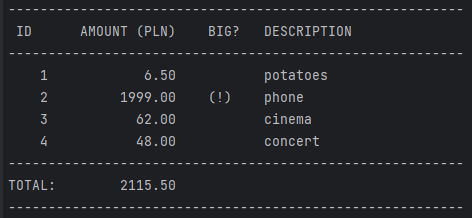

# Budget Manager
> This command-line Python program makes it easy to track household budget expenses and analyze them. 
> The program allows You to easily add new expenses and generate reports.


## Table of Contents
* [General Info](#general-information)
* [Technologies Used](#technologies-used)
* [Features](#features)
* [Screenshots](#screenshots)
* [Setup](#setup)
* [Usage](#usage)
* [Acknowledgements](#acknowledgements)


## General Information
The purpose of the program is to track Your own expenses and analyze them. 
You can add, report, import and export expenses right at run the program.

Tanks to this project, I learned how to:
- write definitions with only one responsibility,
- easy write _classes_ using `@dataclass` decorator,
- use Python standard library modules: _csv_, _dataclasses_, _pickle_, _sys_,
- use Python external packages like _click_ (_Command Line Interface Creation Kit_).


## Technologies Used
- [Python](https://www.python.org/) - version 3.11.3
- from Python's standard library:
  - [_csv_](https://docs.python.org/3/library/csv.html) module
  - [_dataclasses_](https://docs.python.org/3/library/dataclasses.html) module
  - [_pickle_](https://docs.python.org/3/library/pickle.html) module
  - [_sys_](https://docs.python.org/3/library/sys.html) module
- from external Python packages:
  - [_click_](https://pypi.org/project/click/) package - version 8.1.3


## Features
- The program has subcommands: add, report, export-python and import-csv:
  - _**add**_ - allows you to add a new expense,
  - _**report**_ - displays all the expenses in the table with total sum,
  - _**import-csv**_ - imports the list of expenses from a CSV file,
  - _**export-python**_ - displays the list of all expenses as an object,
- The program stores a database of all expenses in _data_ directory as _budget-database.db_ file. 
If the file does not exist, automatically creates a new empty database in _data_ directory.


## Screenshots



## Setup
I assume You know how to cloning this repository. If not, I refer you to 
[this publication](https://docs.github.com/en/repositories/creating-and-managing-repositories/cloning-a-repository)

Python version should not matter here, although the program was written and tested on version 3.11.3. 
You can check Python version by typing in terminal:
```bash
python --version
```

Now You need to create and activate _virtual environment_ like this:
```bash
$ python -m venv .venv
$ cd .venv\Scripts
$ activate
$ cd..
$ cd..
```
and install _click_ package in the previously created _virtual environment_:
``` bash
$ pip install -r requirements.txt
```
or
``` bash
$ pip install -U click
```

After installing this, run the program like bellow.


## Usage
To _**add**_ some expense type in terminal like this:
```bash
$ python budget-manager.py add 100 "some expense"
```

To _**import**_ CSV file with expenses type in terminal:
```bash
$ python budget-manager.py import-csv data\expenses.csv
```

To _**report**_ expenses, if You have saved in database any:
```bash
$ python budget-manager.py report
```

To display list of all expenses as an Python object:
```bash
$ python budget-manager.py export-python
```


## Acknowledgements
- This program was inspired by one of exercises of
[the Practical Python](https://praktycznypython.pl/) educational program
- Many thanks to [Krzysztof Mędrela](https://medrela.com/)
